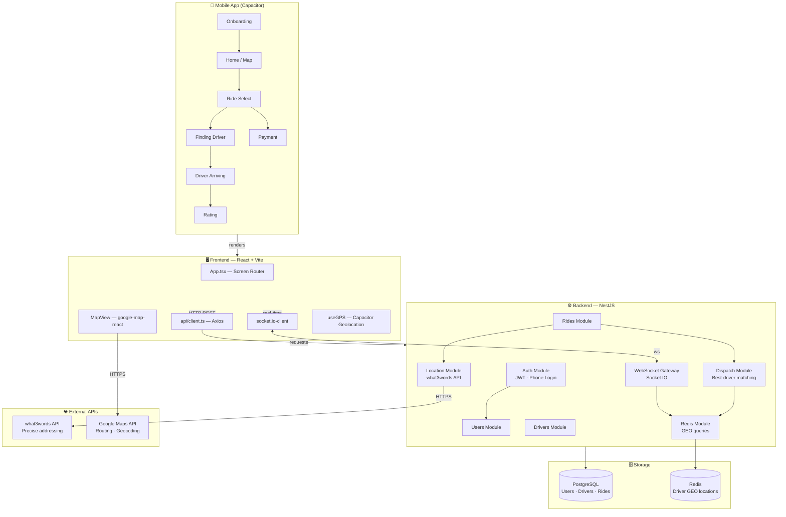
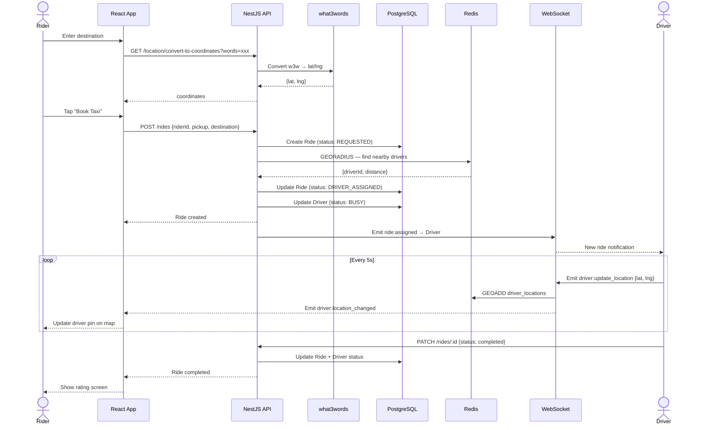
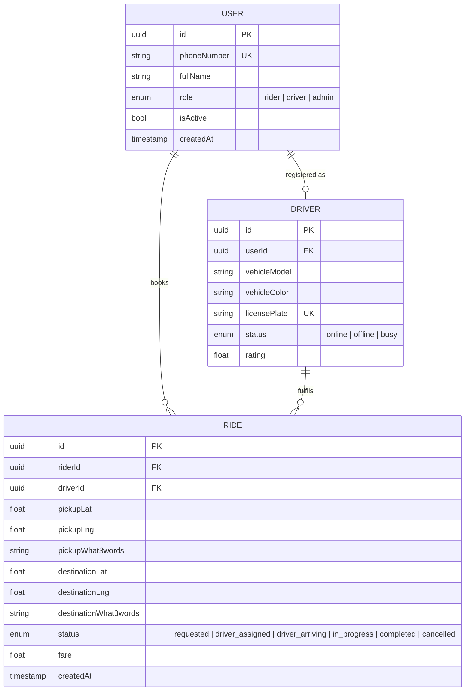
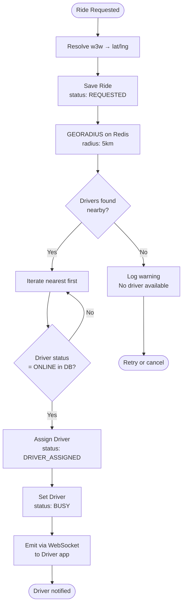
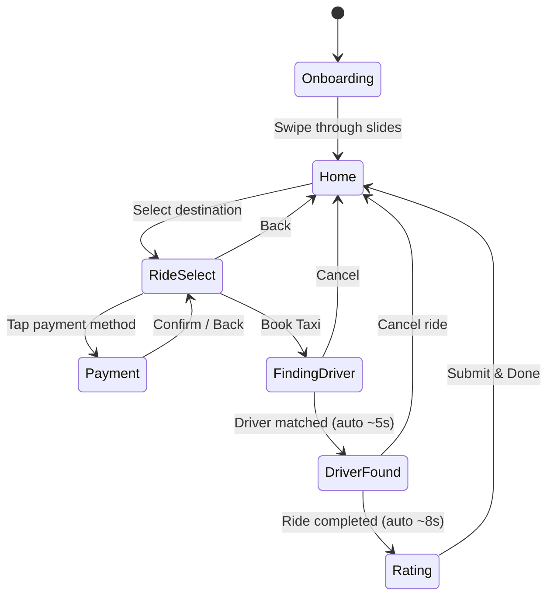

# Kaalay — Ride-Hailing Platform

A ride-hailing and logistics platform optimised for Africa, using what3words for precise location addressing.

---

## Architecture Overview



---

## Request Flow — Booking a Ride



---

## Data Model



---

## Dispatch Algorithm



---

## Screen Flow



---

## Tech Stack

| Layer | Technology |
|-------|-----------|
| Mobile shell | Capacitor (iOS + Android) |
| Frontend | React 19, Vite 8, TypeScript |
| UI components | Ant Design 6, @ant-design/icons |
| Maps | google-map-react, Google Maps API |
| Location | what3words API |
| Real-time | Socket.IO (client + server) |
| Backend | NestJS, TypeScript |
| Auth | JWT, phone-number login |
| ORM | TypeORM |
| Database | PostgreSQL 15 |
| Cache / GEO | Redis 7 (GEOADD / GEORADIUS) |
| Infra | Podman Compose |

---

## Project Structure

```
kaalay/
├── docker-compose.yml          # PostgreSQL + Redis + Adminer (Podman Compose)
├── apps/
│   ├── backend/                # NestJS API
│   │   └── src/
│   │       ├── auth/           # JWT · phone login
│   │       ├── users/          # User entity + CRUD
│   │       ├── drivers/        # Driver entity + status
│   │       ├── rides/          # Ride lifecycle + WebSocket gateway
│   │       ├── dispatch/       # GEO-based driver matching
│   │       ├── location/       # what3words integration
│   │       └── redis/          # Redis GEO service
│   └── frontend/               # React + Vite + Capacitor
│       └── src/
│           ├── screens/        # 7 mobile screens
│           ├── components/     # MapView, LocationPicker
│           ├── hooks/          # useGPS
│           └── api/            # Axios client
```

---

## How to Run

### 1. Start Infrastructure (PostgreSQL & Redis)
You need [Podman](https://podman.io/docs/installation) and [podman-compose](https://github.com/containers/podman-compose) installed. Run the following command from the root `kaalay` folder:
```bash
podman-compose up -d
```

### 2. Configure Environment Variables
Inside `apps/backend/.env`, ensure you have your API keys set:
```env
W3W_API_KEY=YOUR_WHAT3WORDS_API_KEY
GOOGLE_MAPS_API_KEY=YOUR_GOOGLE_MAPS_API_KEY
```

### 3. Start the Backend API
In a new terminal:
```bash
cd apps/backend
npm install
npm run start:dev
```
The NestJS server will start on `http://localhost:3000`.

### 4. Start the Frontend (Web)
In a new terminal:
```bash
cd apps/frontend
npm install
npm run dev
```
The Vite development server will start. Open the provided `localhost` link to use the web application.

### 5. Run the Mobile App (Capacitor)
If you want to run the project as a native mobile app on a simulator or physical device:
```bash
cd apps/frontend
npm run build
npx cap sync

# To open in Android Studio:
npx cap open android

# To open in Xcode (macOS only):
npx cap open ios
```
